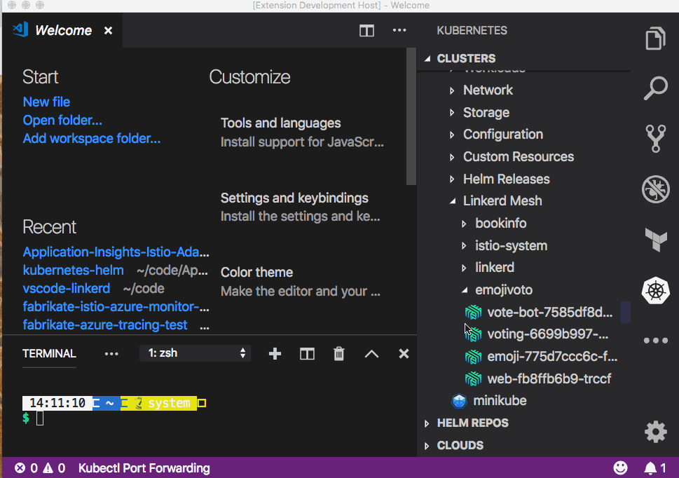

# VSCode Linkerd

## Introduction

This is the Visual Studio Code Linkerd extension, built to work with the [VSCode Kubernetes Extension](https://github.com/Azure/vscode-kubernetes-tools), and the [Linkerd2 Service Mesh](https://linkerd.io/2/getting-started/).

If you are not familiar with what a Service Mesh, [this guide](https://buoyant.io/2017/04/25/whats-a-service-mesh-and-why-do-i-need-one/) is a great place to start!

## Features

#### Cluster Explorer commands

The following commands are triggered when right clicking a cluster under the Kubernetes Cluster Explorer.

* `Linkerd Check`:  Check Linkerd status, and diagnosing issues with the installation
* `Linkerd Install`:  Install Linkerd, and configure custom parameters to your cluster
* `Linkerd Dashboard`: Open and interact with the Linkerd dashboard

#### Linkerd Mesh Explorer commands

The following commands are triggered when right clicking a meshed resource under the Linkerd Mesh Explorer.

* `Linkerd: Open Dashboard to Pod`:  Open and interact with a meshed pod with the Linkerd dashboard
* `Linkerd: Open Dashboard to Namespace`:  Open and interact with a meshed namespace with the Linkerd
dashboard

* `Linkerd: Open Grafana Dashboard`: Open and interact with the Grafana dashboard
* `Linkerd: Open Grafana Dashboard to Pod`: Open and interact with the Grafana Dashboard for a Pod

## Dependencies

- [VSCode Kubernetes Tools v1.0.0 or higher](https://github.com/Azure/vscode-kubernetes-tools/releases/tag/1.0.0) and [it's dependencies](https://github.com/Azure/vscode-kubernetes-tools#dependencies), installed and [configured](https://github.com/Azure/vscode-kubernetes-tools#extension-settings).
- The Linkerd binary [installed on your system](https://linkerd.io/2/getting-started/#step-1-install-the-cli)

## Extension Settings

In your workplace or user settings (editable from `Preferences -> Open Settings (UI) from the command palette`, or `Preferences -> Settings` from the application bar), add the following fields:

- `linkerd-path`: Path to the linkerd binary on your system. **Required!**
- `linkerd-namespace`: Namespace where linkerd may be found in your Kubernetes cluster. Default: `linkerd`
    - Note: If linkerd is not found in this namespace, the extension will default to installing in this namespace.

## Issues

Please [report any issues](https://github.com/bnookala/vscode-linkerd/issues) to this repository.

## License

MIT - See [LICENSE](./LICENSE)
